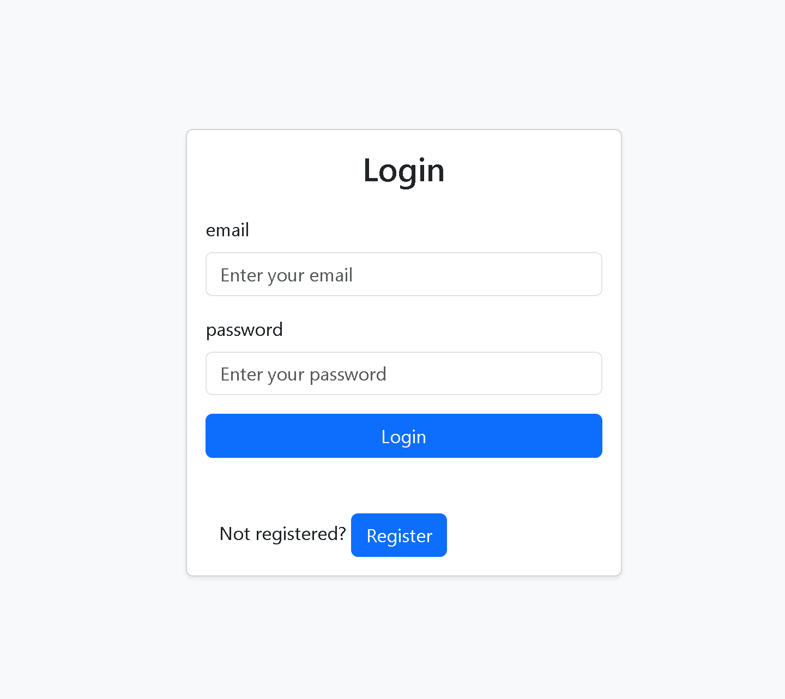
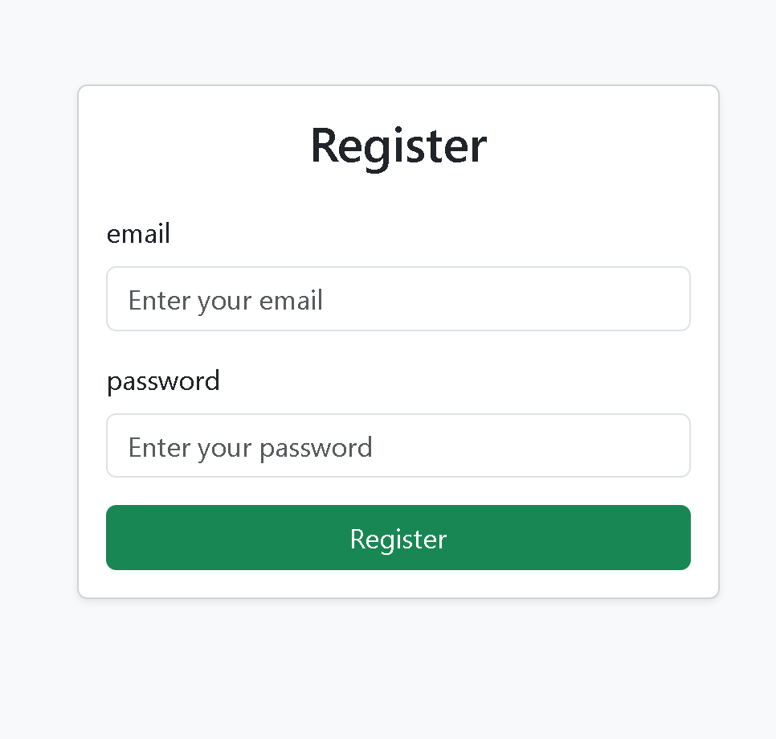
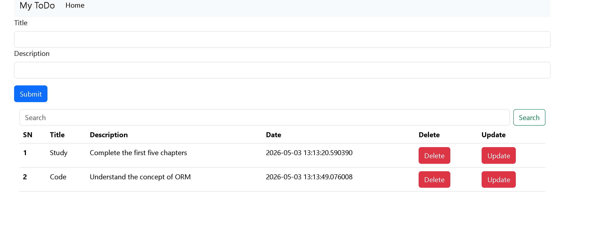

# TODO System Using Flask

This is a full-stack web-based TODO application built using Flask. The project demonstrates backend development fundamentals including routing, CRUD operations, template rendering, and basic web application architecture. It is designed as a learning project to strengthen understanding of Flask-based backend systems and server-side application development.

## Key Features
- Create new TODO tasks
- View all tasks in a structured list
- Update existing tasks
- Delete tasks
- Mark tasks as completed
- Dynamic UI rendering using Flask templates

## Tech Stack
Backend: Python, Flask  
Frontend: HTML, CSS, JavaScript  
Optional: MongoDB / database integration (if used)

## Core Concepts Demonstrated
- Flask routing and request handling
- CRUD operations
- Template rendering using Jinja2
- Form data processing
- Basic MVC-style structure
- Static file handling

----

## Installation & Setup

git clone https://github.com/sambad-K/TODO-System-Using-Flask.git  
cd TODO-System-Using-Flask  

python -m venv venv  
venv\Scripts\activate   (Windows)  
source venv/bin/activate   (Mac/Linux)  

pip install -r requirements.txt  

python app.py  

Open browser: http://127.0.0.1:5000/

## Learning Outcomes
- Flask backend development
- HTTP request handling (GET/POST)
- CRUD application design
- Template rendering
- Web app structure

## Skills Demonstrated
Python, Flask, Backend Development, CRUD Systems, Web Application Architecture

## Future Improvements
- Database integration (MongoDB / SQL)
- Authentication system
- Task filtering and prioritization
- REST API version
- Deployment on cloud platforms
---
## Contact  
- Email: sambadkhatiwada939@gmail.com
- Linkedin:https://www.linkedin.com/in/sambad-khatiwada/
- Github: https://github.com/sambad-K/
---
## License
This project is for educational purposes only.

## Screenshots
### Login Page

### Register Page

### TODO Dashboard

